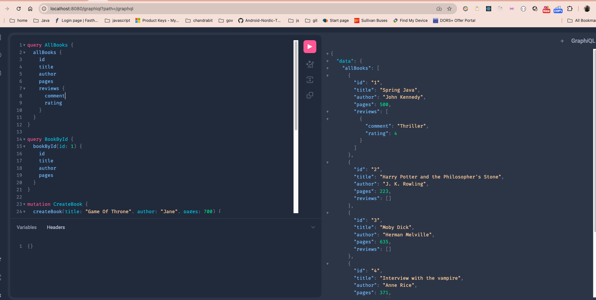
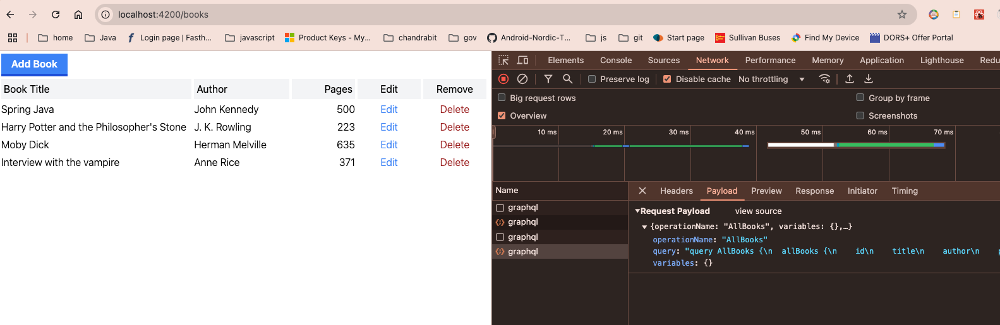

### build combined image
> execute `./buildImage.sh` This will build client and copy artifacts to server static resources 
  
> it will build and push image bookstore-api:spring-boot to docker

> To run both client and server inside docker execute below command, I have to use --security-opt for my docker engine version 20.10.8 on mac

> I am using mac mid 2015 intel chipset and there no upgrade available for many soft wares now including docker so can't get fix applied and have to use workaround
 
> If you have the latest version of docker then you should be able to run image using `Docker compose up` command
> but if you can't then just use below command 

> Run `docker run -it -p 8081:8081 --security-opt seccomp=unconfined  bookstore-api:spring-boot`

> once application is up visit [UI](http://localhost:8081) it should load up UI 

> To check or play graphql visit [graphiql](http://localhost:8081/graphiql)
> 
### For enterprise there should be client/Api gateway, client modules from npm should be build and deployed to different application, and should have separate docker file for individual modules 
### Api 
> Api is written using Java Spring Boot GraphQL Maven Package (BookStore)
> Once project loaded first time wait for dependencies to be resolved and Then execute application
> Verify GrapQL at http://localhost:8080/graphiql?path=/graphql
> 
> Spring boot build image ## Build image
> command `./mvnw package spring-boot:build-image` should build image `bookstore-api` as specified in pom.xml
> To build docker image  `build docker image `docker build -t bookstore -f Dockerfile ./server`
> To run docker image `docker run -d -p 8080:8080 --security-opt seccomp=unconfined bookstore`

### Client
> To run client first move to client/bookstore-client directory
> Execute `npm install`
> Once all npm dependencies are downloaded execute `npm codegen` this should regenerate typescript client code from graphQL Schema
> To run client execute `npm start` ,client should start on http://localhost:4200
> 

